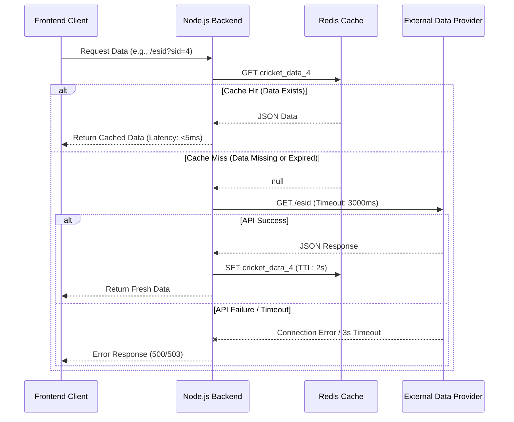

# Redis Caching System Documentation (v1.1)

## 1. System Overview
The Diamond99 backend (`d247-server`) integrates a Redis caching layer to act as a high-speed intermediate buffer between the client (Frontend) and the external Data Provider. This system is critical for reducing latency and protecting the application from upstream instability.

### Visual Architecture



---

## 2. Technical Implementation Details

### Stack
*   **Engine**: Redis (In-memory key-value store).
*   **Client Library**: `ioredis` (Robust, supports auto-reconnect, offline queue).
*   **Hosting**: Local instance (`127.0.0.1:6379`).

### The `getCachedData` Wrapper
The core logic is encapsulated in a helper function used across services (`CricketService`, `CasinoService`).

**Key Features:**
1.  **Fail-Safe Reads**: If Redis is down, it logs the error and transparently falls back to fetching directly from the API. The user never experiences downtime due to a Redis failure.
2.  **Non-Blocking Writes**: The `redis.set` operation is asynchronous and does not block the HTTP response to the user.
3.  **Strict Timeouts**: All upstream API calls have a hard `3000ms` limit. This prevents "zombie" requests from consuming server resources when the external provider is hanging (e.g., specific broken IDs like `11` or `15`).

### Code Reference
```javascript
// Located in: services/CricketService.js & services/CasinoService.js

const getCachedData = async (key, fetchFunction) => {
  // PHASE 1: READ
  try {
    const cached = await redis.get(key);
    if (cached) return JSON.parse(cached); // HIT
  } catch (err) {
    console.error(`❌ Redis Error: ${key}`, err.message);
    // Proceed to fetch from API even if Redis fails
  }

  // PHASE 2: FETCH
  try {
    const data = await fetchFunction(); // Includes 3s timeout
    
    // PHASE 3: WRITE (Fire & Forget)
    redis.set(key, JSON.stringify(data), 'EX', 2).catch(e => console.error(e));
    
    return data;
  } catch (err) {
    throw err; // Propagate timeouts/API errors to controller
  }
};
```

---

## 3. Cache Strategy & Keys

### Key Naming Convention
We use namespaced keys to avoid collisions. The `CACHE_TTL` is globally set to **2 seconds** because the underlying sports data is real-time and changes frequently (odds/scores).

 | Service | Namespace | Variable | Example Key | Content |
 | :--- | :--- | :--- | :--- | :--- |
 | **Cricket** | `cricket_data_` | `{id}` | `cricket_data_4` | Full match list for sport 4 |
 | **Cricket** | `match_private_` | `{gmid}_{sid}` | `match_private_123_4` | Odds/Fancy for specific match |
 | **Casino** | `casino_all_data_` | `{type}` | `casino_all_data_teen20` | Full state of TeenPatti20 table |
 | **Casino** | `casino_last_results_` | `{type}` | `casino_last_results_ab20` | History of last 10 rounds |

### JSON Serialization
Data is stored as stringified JSON. 
*   **Pros**: Simple debugging, human-readable.
*   **Cons**: Serialization overhead (negligible for our payload sizes).

---

## 4. Failure Scenarios Handling

| Scenario | System Behavior | Log Output |
| :--- | :--- | :--- |
| **Normal Operation** | Data served from Redis or refreshed from API. | `⚡ Serving from cache` / `🌐 Fetched from API` |
| **Upstream API Slow (>3s)** | Request aborted. User receives error (preventing hang). | `❌ API Error ... timeout of 3000ms exceeded` |
| **Upstream API 400/500** | Error propagated to controller. No cache update. | `❌ API Error: Request failed with status...` |
| **Redis Down** | seamless fallback to direct API calls. | `❌ Redis Cache Error: Connection refused` |
| **Bad Data (Garbage)** | JSON parse error caught, fresh fetch triggered. | (Implicit in try-catch block) |

---

## 5. Operational Guide

### Monitor Logs
Real-time monitoring of cache performance:
```bash
pm2 logs 6
```

### Redis CLI Tools
You can interact directly with the cache using `redis-cli`:

1.  **Check Key Existence**:
    ```bash
    redis-cli GET cricket_data_4
    ```
2.  **Check Time-To-Live (Remaining seconds)**:
    ```bash
    redis-cli TTL cricket_data_4
    ```
3.  **Manually Flush Cache** (Emergency reset):
    ```bash
    redis-cli FLUSHDB
    ```
4.  **Monitor Commands in Real-time**:
    ```bash
    redis-cli MONITOR
    # Warning: High performance impact, use briefly!
    ```

---

## 6. Performance Impact
*   **Request Volume**: Reduces external API calls by approx. **98-99%** per active user session (assuming polling every 2s).
*   **Concurrency**: Node.js handles thousands of concurrent users serving cached JSON, whereas the external API connection pool would saturate at ~50 concurrent fetches.
*   **Cost**: Significantly reduces bandwidth and API usage limits on the provider side.
